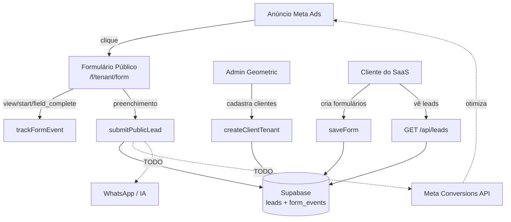

# Geometric Forms

SaaS multi-tenant que substitui o **Lead Ads do Meta** por formulários customizados, qualifica leads por scoring, e devolve eventos para a **Meta Conversions API** otimizar a campanha pela qualidade dos leads — não pela quantidade.

## Stack

- **Banco:** Supabase (PostgreSQL + Auth + RLS)
- **Backend:** Node.js 20+ / Express (ESM)
- **Validação:** zod
- **Integrações futuras (esqueleto pronto):** Meta Conversions API, WhatsApp Cloud API, IA de qualificação

## Arquitetura



## Camadas de acesso

| Camada | Quem | Autenticação | Rotas |
|---|---|---|---|
| Admin | Equipe Geometric | Supabase JWT com `role='admin'` | `/api/admin/*` |
| Cliente | Dono do negócio | Supabase JWT com `role='client'` | `/api/forms`, `/api/leads` |
| Público | Consumidor final | Sem auth | `/api/public/*` |

RLS isola dados por `tenant_id` via funções `is_admin()` e `current_tenant_id()` que leem `public.profiles`.

## Setup

```bash
# 1) Dependências
npm install

# 2) Variáveis de ambiente
cp .env.example .env
# preencher SUPABASE_URL, SUPABASE_ANON_KEY, SUPABASE_SERVICE_ROLE_KEY

# 3) Schema no Supabase
# Opção A — CLI (recomendado):
npx supabase db push
# Opção B — Dashboard: copie database/schema.sql no SQL Editor

# 4) Criar primeiro admin
#   a) Authentication → Users → Add user (email + senha)
#   b) SQL Editor:
#        update public.profiles set role='admin', tenant_id=null where email='admin@geometric.com';

# 5) Rodar
npm run dev
```

## Testando com curl

### 1) Pegar JWT do admin

```bash
curl -s -X POST 'https://cslyxnpxlytzqjurhdmd.supabase.co/auth/v1/token?grant_type=password' \
  -H 'apikey: SUPABASE_ANON_KEY' \
  -H 'Content-Type: application/json' \
  -d '{"email":"admin@geometric.com","password":"SUA-SENHA"}' \
  | jq -r .access_token
```

### 2) Criar tenant (com JWT admin)

```bash
curl -s -X POST http://localhost:3000/api/admin/tenants \
  -H 'Authorization: Bearer SEU-JWT-ADMIN' \
  -H 'Content-Type: application/json' \
  -d '{
    "tenant": {
      "name": "Pillar Consórcios",
      "slug": "pillar-consorcios",
      "primary_color": "#1a3a2e",
      "plan": "starter"
    },
    "owner": {
      "email": "carlos@pillar.com",
      "full_name": "Carlos Yoshimori",
      "password": "SenhaForte123!"
    }
  }'
```

### 3) Logar como cliente novo (pega o JWT do owner)

```bash
curl -s -X POST 'https://cslyxnpxlytzqjurhdmd.supabase.co/auth/v1/token?grant_type=password' \
  -H 'apikey: SUPABASE_ANON_KEY' \
  -H 'Content-Type: application/json' \
  -d '{"email":"carlos@pillar.com","password":"SenhaForte123!"}'
```

### 4) Criar formulário (com JWT cliente)

```bash
curl -s -X POST http://localhost:3000/api/forms \
  -H 'Authorization: Bearer JWT-DO-CLIENTE' \
  -H 'Content-Type: application/json' \
  -d '{
    "title": "Qualificação Consórcio",
    "description": "Preencha para receber proposta personalizada",
    "qualification_threshold": 5,
    "fields": [
      {
        "id": "renda",
        "type": "radio",
        "label": "Qual sua renda mensal?",
        "required": true,
        "order": 1,
        "options": [
          { "label": "Até R$ 3 mil", "value": "ate_3k", "score": 1 },
          { "label": "R$ 3 mil a R$ 10 mil", "value": "3k_10k", "score": 5 },
          { "label": "Acima de R$ 10 mil", "value": "acima_10k", "score": 10 }
        ]
      },
      {
        "id": "email",
        "type": "email",
        "label": "Email",
        "required": true,
        "order": 2
      }
    ]
  }'
```

### 5) Submeter lead público (sem auth)

```bash
curl -s -X POST http://localhost:3000/api/public/leads \
  -H 'Content-Type: application/json' \
  -d '{
    "form_id": "UUID-DO-FORM",
    "event_id": "test-001",
    "answers": {
      "renda": "acima_10k",
      "email": "lead@exemplo.com"
    },
    "tracking": {
      "utm_source": "facebook",
      "utm_campaign": "consorcio-jan",
      "fbp": "fb.1.xxx",
      "fbc": "fb.1.yyy"
    }
  }'
# → { lead_score: 10, is_qualified: true }
```

Idempotente: enviar o mesmo `event_id` de novo retorna o lead existente sem duplicar.

### 6) Trackear evento de funil

```bash
curl -s -X POST http://localhost:3000/api/public/events \
  -H 'Content-Type: application/json' \
  -d '{
    "form_id": "UUID-DO-FORM",
    "event_type": "view",
    "session_id": "sess-abc-123",
    "metadata": { "page_url": "https://forms.geometric.com/..." }
  }'
```

## Modelo de dados

- **`tenants`** — empresas clientes (slug, brand, plano)
- **`profiles`** — extensão de `auth.users` com `role` e `tenant_id`
- **`forms`** — formulários por tenant; `fields` é `jsonb` com schema dinâmico; threshold de qualificação por form
- **`leads`** — submissões com `answers`, `lead_score`, `is_qualified`, UTMs, fbc/fbp, status do funil (`novo → ia → reunião → ganho/perdido`)
- **`form_events`** — eventos do funil (view/start/field_complete/submit/qualified)

RLS está habilitado em todas; veja [supabase/migrations/](supabase/migrations/).

## Próximos passos

- [ ] Ativar chamada real da Meta Conversions API em [src/lib/metaCapi.js](src/lib/metaCapi.js) (a estrutura está pronta, basta descomentar o `fetch`)
- [ ] Webhook pra n8n / WhatsApp Cloud API em [submitPublicLead.js](src/functions/submitPublicLead.js)
- [ ] Frontend admin, frontend cliente, frontend público (Next.js)
- [ ] Criptografar `meta_access_token` em repouso
- [ ] Rate limiting nas rotas públicas (`express-rate-limit`)
